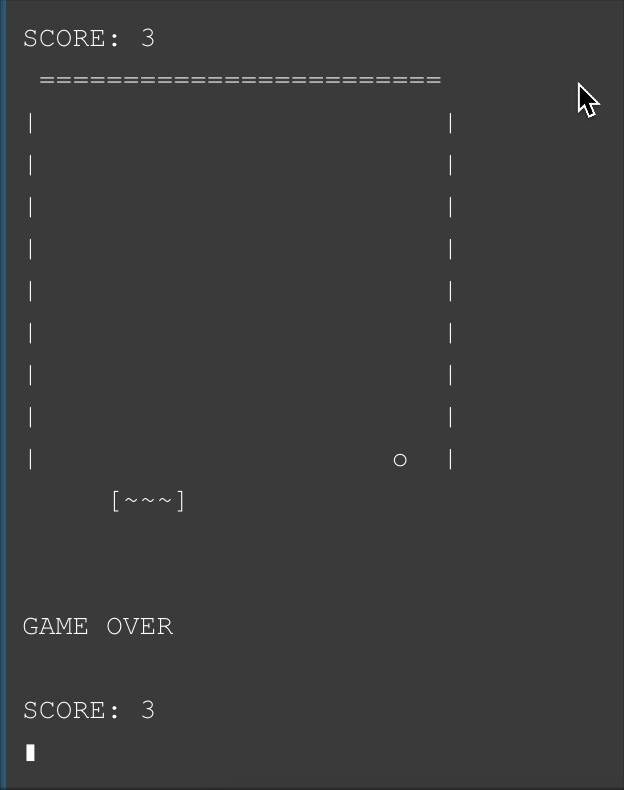

# LC3-pong

This is a recreation of a brick/pong game built in Assembly using the LC-3 simulator. The game includes features like score tracking and a Game Over state.

## Table of Contents

- [Installation](#installation)
- [How to Play](#how-to-play)
- [Screenshots](#screenshots)

## Installation

LC-3 can be found here: [LC3Tools](https://github.com/chiragsakhuja/lc3tools)

Clone the repository and open `main.asm` in the LC3Tools.

Compile and run.

## How to Play

#### Controls

- `A` moves left
- `D` moves right

Dont let the ball get past the brick at the bottom of the screen! Each successful bounce gets you one point.

## Screenshots

Keeps track of score.

Game includes a Game Over state.

